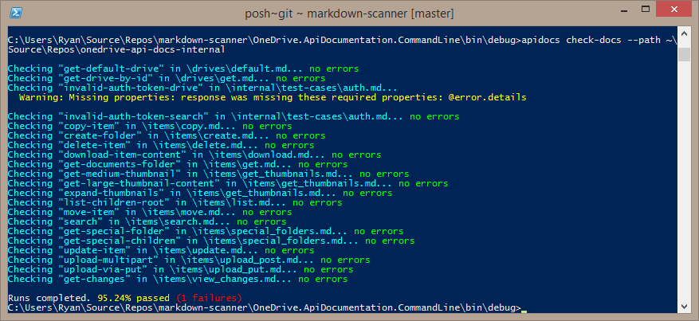

# API Documentation Test Tool

[](https://ci.appveyor.com/project/OneDrive/markdown-scanner/branch/master)

The API documentation test tool makes it easy to validate that the Markdown-based API
documentation matches a REST service implementation.

The toolset includes a command line and GUI application that can be used to
perform for the following validations:

* Check for broken links in the documentation.
* Print resource and method definitions.
* Verify that the documentation is internally consistent:
  * Check that defined resources and APIs that return these resources match.
  * Check that example API responses are consistent with the resources they should return.
* Verify that a target REST service matches the API documentation:
  * Check that requests and responses in the documentation match the service.
  * Inject parameters into the API calls to the service.
* Publish documentation to an output folder.

## Building
To build the project, invoke either `msbuild` or `xbuild` depending on your
platform. This tool is compatible with Mono or .NET.

## Command Line Tool



`apidocs.exe [command] [options]`

Available commands are:

* `print` - Print files, resources, and methods discovered in the documentation.
* `check-links` - Verify that links in the documentation aren't broken.
* `check-docs` - Check for errors in the documentation's resources, requests, and response examples.
* `check-service` - Check for differences between the documentation and service responses to documented requests.
* `publish` - Publish the documentation into one of the supported output formats.

All commands have the following options available:

| Option             | Description                                                                                 |
|:-------------------|:--------------------------------------------------------------------------------------------|
| `--path <path>`    | Path to the root of the documentation set to scan. If missing, the current path is assumed. |
| `--short`          | Print concise output to the console.                                                        |
| `--verbose`        | Print verbose output to the console, including full HTTP requests/responses.                |
| `--log <log_file>` | Log console output to a file.                                                               |
| `--parameters <params>` | A URL-encoded string containing key/value pairs. Allows additional parameters to be passed to the task. Currently used by the tagging feature to specify content to include. For more information see [Markdown customizations](docs/markdown-customizations.md). |

### Print Command
Print information about the source files, resources, methods, and requests
that were parsed by the tool.

| Option        | Description                                                       |
|:--------------|:------------------------------------------------------------------|
| `--files`     | Output information about the files contained in the document set. |
| `--resources` | Output resource definitions read from the documentation.          |
| `--methods`   | Output method definitions read from the documentation.            |

One of these three arguments is required to use the `print` command.

### Check-links Command
Check for broken links in the documentation.

No specific options are required. Using `--verbose` will include warnings about
links that were not verified.

Example: `apidocs.exe check-links --path ~/github/api-docs --method search`

### Check-docs Command
The `check-docs` command ensures that the documentation is internally consistent.
It verifies that:

* The JSON examples are proper JSON
* The API methods that accept or return a specific resource type have valid request/response examples
* The metadata in the documentation is formatted properly

| Option                   | Description                                                                                        |
|:-------------------------|:---------------------------------------------------------------------------------------------------|
| `--method <method_name>` | Optional. Specify the name of a request method to evaluate. If missing, all methods are evaluated. |

Example: `apidocs.exe check-docs --path ~/github/api-docs --method search`

### Check-service Command

Check the documented requests and responses against an actual REST service. This
option will load accounts from a configuration file (see below), environment
variables or use the specified access-token and url parameters to determine
how to make API calls with the target service.

Any scenario files that are contained within the documentation path will
automatically be loaded and used by the check-service method.

| Option                     | Description                                                                                                                                                                             |
|:---------------------------|:----------------------------------------------------------------------------------------------------------------------------------------------------------------------------------------|
| `--access-token "token"`   | OAuth access token to use when calling the service. You may need to escape the token value by enclosing it in double quotes.                                                            |
| `--branch-name <branch>`   | Optional. Specify the branch name that is the source of the documentation. Compares this name to the configuration file to see if the check-service command is allowed for this branch. |
| `--headers <headers>`      | Optional. Enables adding additional headers to every API call made by check-service. The format should be a quoted string with a | separating different header lines.                   |
| `--ignore-scopes`          | Optional. Disables using scopes to determine which methods are exercised on an account. |
| `--method <method_name>`   | Optional. Check a single request/response method instead of everything in the documentation.                                                                                            |
| `--odata-metadata <value>` | Optional. Specify the value of the odata.metadata level that is provided in the Accept header.                                                                                          |
| `--pause`                  | Pause for a key press between API calls to the service to enable reading the responses.                                                                                                 |
| `--scopes <scopes>`        | Provide a command separated list of scopes which are provided by the command line accessToken. |
| `--url <url>`              | Set the base URL for the service calls.                                                                                                                                                 |

Example:
```
apidocs check-service --method "search" --access-token "foo" --url https://example.org/v1.0
apidocs check-service --headers "If-Match: *|Application: apidocs-test-app" --odata-metadata "odata.metadata=none"
```

#### Account configuration file
You can specify account information in a configuration file stored inside the
documentation set. Apidocs will look for any .json file that includes an
`accounts` property include an array of account objects. These accounts will
be used by the `check-service` command.

[See more details about account configuration files.](docs/account-configuration.md).


#### Account by environment variables

Instead of using an access token on the command line or an account configuration file
you can use the following environment variables to provide a refresh token and
token service to generate access tokens. This enables the tool to be used in
automation scripts and other scenarios where it may not be possible to provide
an access-token in any other way.

| Variable name           | Description                                                                |
|:------------------------|:---------------------------------------------------------------------------|
| **oauth-token-service** | URL for the OAuth 2.0 token service to be used to retrieve an access token |
| **oauth-client-id**     | Client ID that is passed to the token service                              |
| **oauth-client-secret** | Client Secret that is passed to the token service                          |
| **oauth-redirect-uri**  | Redirect URI used to generate the refresh token                            |
| **oauth-refresh-token** | Refresh token that is used to generate an access token                     |

If these environment variables are set, it is not necessary to pass an access
token using the `--access-token` command line parameter. The tool will call the
token service to retrieve an access token when necessary.

### Publish Command
The `publish` command uses the documentation to generate a new set of outputs.

See the documentation on [publishing using APIDocs](docs/publishing.md) for
more details.

## Documentation format
See [Markdown requirements](docs/markdown-requirements.md) for more details about
requirements on the markdown source for documentation.

## Request parameters

The tool also supports defining parameters for requests in a separate file. This
information is loaded and used to make one or more requests to the service by
substituting values for placeholders in the initial request.

For example, in a request for an item with a particular ID, you might write the
request to look like this:

```
<!-- { "blockType": "request"; "name": "get-drive" } -->
GET /drives/{drive-id}
```

However, when the test tool makes the API call to the service, calling it verbatim
would result in an error. Request parameters allow you to define one or more
scenarios that are used to call the method.

A scenario can have one or more statically defined properties. It can also include
an HTTP request and substitute one or more placeholder values with data from
the response to that request.

The scenario file contains a single JSON array, with each member of the array
conforming to this schema:

```json
{
  "name": "Copy test_copy_file to a new location",
  "method": "copy-item",
  "enabled": true,
  "test-setup": [
    {
      "method": "upload-via-put",
      "http-request": "PUT /drive/root:/test_copy_file.txt:/content\r\nContent-Type: application/octet-stream\r\n\r\nTest file that we will copy to another location",
      "request-parameters":
      {
        "{path-to-file}": "/test_copy.file.txt",
        "!body": "Test file that we will copy to another location",
        "Content-Type:": "application/octet-stream"
      },
      "allowed-status-codes": [ 200 ],
      "capture": {
         "[source-file-id]": "$.id",
         "[response-type]": "Content-Type:",
         "[response-body]": "!body"
         }
    }
  ],
  "request-parameters":
  {
    "{item-id}": "[source-file-id]"
  },
  "expectations":
  {
	"$.size": 123,
	"content-type:" "application/json",
	"$.id": ["12345", "67890"]
  }
}
```

| Property             | Type            | Description                                                                                                                                     |
|:---------------------|:----------------|:------------------------------------------------------------------------------------------------------------------------------------------------|
| `name`               | string          | The name of the scenario described.                                                                                                             |
| `method`             | string          | The name of the method this scenario uses. Either defined in the documentation or a substitute name is auto-generated.                          |
| `enabled`            | bool            | Enable or disable the scenario.                                                                                                                 |
| `test-setup`         | array           | See below.                                                                                                                                      |
| `request-parameters` | key-value pairs | Specify the key-value pairs for parameters for the request. The key is used as a placeholder name, and the value is subed into the placeholder. |
| `expectations`       | key-value pairs | Specify the expected values in the final response. The keys are the same [Capture Grammar](#capture-grammer) defined for request-parameters.    |

### Test setup

The test-setup property allows you to define an array of calls that are made
before the actual test method is executed. This allows you to pull values from
other requests and store them to be used in the test method call. This also
allows you to chain together multiple calls from the documentation to enable
testing complex scenarios, like fragment uploads.

Each object in the array of `test-setup` is a `PlaceholderRequest` instance.

| Property               | Type            | Description                                                                                                                                                                                                   |
|:-----------------------|:----------------|:--------------------------------------------------------------------------------------------------------------------------------------------------------------------------------------------------------------|
| `method`               | string          | The name of a method from the documentation that should be used as this test-setup call                                                                                                                       |
| `http-request`         | string          | Instead of specifying a method from the docs, you can input a raw HTTP request to be used.                                                                                                                    |
| `request-parameters`   | key-value pairs | Specify the key-value pairs for parameters for the request. The key is used as a placeholder name, and the value is subed into the placeholder.                                                               |
| `allowed-status-codes` | array of int    | Normally the request is considered failed of the response is anything other than 2xx. Use this to allow error codes and other responses to be considered valid.                                               |
| `capture`              | key-value pairs | Specify the key-value pairs of values that are read from this response and stored for another request under this scenario. Allows you to store values and use them in other requests under the same scenario. |
| `canned-request`       | string          | The name of the canned-request defined in the scenario file that is executed. This way common requests can be stored in one place instead of repeated throughtout the test files.                             |


### Canned Requests
Canned requests look just like a test setup method, but instead of being a
scenario for a particular method are avaialble to be used from any scenario
definition.

```json
{
  "canned-requests": [
    {
      "name": "create-photo-item",
      "method": "upload-via-put",
      "request-parameters": {
        "{item-path}": "!random-filename-png",
        "!body.base64": "iVBORw0KGgoAAAANSUhEUgAAAAUAAAAFCAYAAACNbyblAAAAHElEQVQI12P4//8/w38GIAXDIBKE0DHxgljNBAAO9TXL0Y4OHwAAAABJRU5ErkJggg=="
      },
      "capture": {
        "[item-id]": "$.id"
      }
    }
  ]
}
```


### Placeholder grammar

When specifying a placeholder name or value, the following syntax is used:

| Syntax          | Example                | Description                                                                                                                               |
|:----------------|:-----------------------|:------------------------------------------------------------------------------------------------------------------------------------------|
| Curly Braces    | `{path-to-file}`       | Find and update a value in the URL matching the full string.                                                                              |
| Square Braces   | `[source-file-id]`     | Look for a previous stored value that was output from a previous request within the same scenario.                                        |
| JPath           | `$.id`                 | Replace a property value in the JSON body of the request. If the content-type of the request is not application/json an error will occur. |
| !body           | `!body`                | Replace the content stream of the request with the provided value                                                                         |
| !body.base64    | `!body.base64`         | Replace the content stream of the request with a decoded byte stream of the base 64 value provided.                                       |
| !url            | `!url`                 | Replace the URL for the request with the provided value.                                                                                  |
| Header:         | `Content-Type:`        | Replace the value of a header with the specified value. Note the header name must end with a colon to be valid.                           |
| Random Filename | `!random-filename-png! | Returns a randomly generated value with a particular file extension that can be used to ensure tests don't interfere with each other.     |

### Capture grammar

The `key` of anything in the `capture` node MUST be wrapped in square
brackets `[foobar]`. Otherwise the parameters will not be considered value.

The output-value grammar follows the same syntax as the placeholder grammar:

| Syntax  | Example         | Description                                           |
|:--------|:----------------|:------------------------------------------------------|
| JPath   | $.id            | Read and store the value at the JPath                 |
| Header: | `Content-Type:` | Read and store the value of the specified HTTP header |
| !body   | !body           | Read and store the complete body of the response      |

### Code block annotation properties

The HTML-comment enclosed JSON object inside the documentation has the following
properties defined:

```json
{
	"blockType": "unknown | resource | request | response | ignored | example | simulatedResponse",
	"@odata.type": "resource name",
	"optionalProperties": [ "prop1", "prop2" ],
	"isCollection": false,
	"collectionProperty": "value",
	"isEmpty": false,
	"truncated": true,
	"name": "string name",
	"expectError": false,
	"nullableProperties": [ "prop3", "prop4" ]
}
```

#### Property descriptions

| Name                   | Value            | Allowed blocks                       | Description                                                                                                                                                                                                     |
|:-----------------------|:-----------------|:-------------------------------------|:----------------------------------------------------------------------------------------------------------------------------------------------------------------------------------------------------------------|
| **blockType**          | string           | All                                  | Describes the type of the json block proceeding the annotation.                                                                                                                                                 |
| **@odata.type**        | string           | All                                  | Describes the name of the resource (either being defined, in the case of a resource block, or as the body type on a request/response block)                                                                     |
| **optionalProperties** | array of strings | resource                             | An array of properties that are not required to be in the code block.                                                                                                                                           |
| **isCollection**       | boolean          | response, example, simulatedResponse | Indicates that the block contains a collection of items that match the **@odata.type** schema. This is expected as an object with a single property that is an array of objects.                                |
| **collectionProperty** | string           | response, example, simulatedResponse | Provides the name of the variable that contains the collection. Default value: `value`.                                                                                                                         |
| **isEmpty**            | boolean          | response, example, simulatedResponse | Indicates that the collection value is expected to be empty (or not).                                                                                                                                           |
| **truncated**          | boolean          | response, example, simulatedResponse | Indicates that the block will not include all properties of the resource and that's not an error. Properties explicitly shown in the code block are always considered required when tested against the service. |
| **name**               | string           | request, example                     | Provides the name of the request method being defined.                                                                                                                                                          |
| **expectError**        | boolean          | response, example, simulatedResponse | Use this to indicate that instead of returning the normal response as defined, an error response will be returned.                                                                                              |
| **nullableProperties** | array of strings | response, example, simulatedResponse | Provide a list of properties that are allowed to have null values. By default, null values for a property will generate a warning.                                                                              |


#### Block types
| Name                | Description                                                                                                                          |
|:--------------------|:-------------------------------------------------------------------------------------------------------------------------------------|
| `resource`          | The json block describes a system resource (complex type) in the API.                                                                |
| `request`           | The json block describes an HTTP request that can be made by clients.                                                                |
| `response`          | The json block describes the HTTP response that is sent from the service.                                                            |
| `example`           | An example of the JSON data that would be generated by the client or returned by the service, without being wrapped in an HTTP call. |
| `simulatedResponse` | Used for unit testing to simulate responses from the service.                                                                        |
| `ignored`           | No processing is done on the code block that follows.                                                                                |


## Open Source

See [OpenSourceNotes](OpenSourceNotes.md) for more details about open source usage in markdown-scanner.

This project has adopted the [Microsoft Open Source Code of Conduct](https://opensource.microsoft.com/codeofconduct/). For more information see the [Code of Conduct FAQ](https://opensource.microsoft.com/codeofconduct/faq/) or contact [opencode@microsoft.com](mailto:opencode@microsoft.com) with any additional questions or comments.
